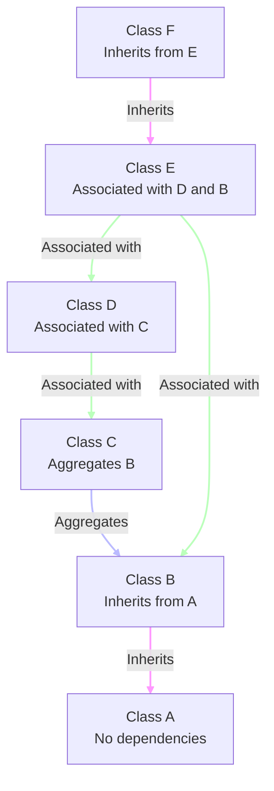
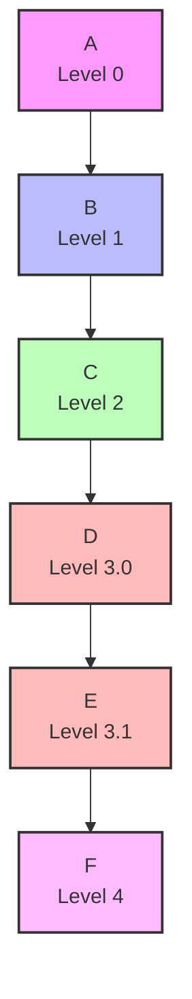
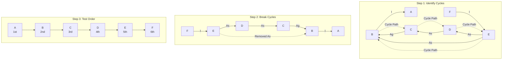
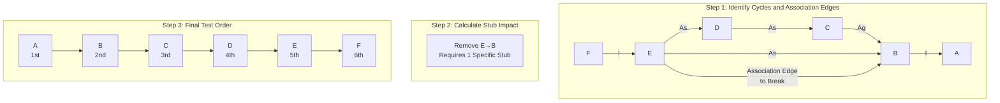
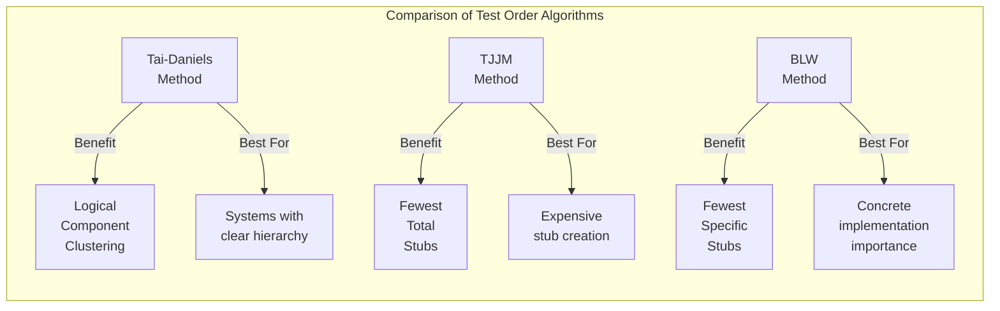

# LLM Integration Testing Framework Strategy

## Executive Summary

This report outlines a comprehensive approach to integration testing for applications with minimal existing test coverage. The strategy leverages our LLM-powered framework for dependency analysis to identify critical integration points and prioritize testing efforts. The goal is to develop and implement integration tests that validate the interactions between different components, ensuring system stability and reducing regression risks.

## 1. Understanding the Current Context

### Current State Assessment

- Modern applications with connections to databases, APIs, and UI components
- Often limited integration test coverage
- Technology stacks spanning multiple languages and frameworks
- Solution is built using Python with LLM capabilities

### Challenges

- Code with limited or no test coverage
- Complex dependencies between components
- Limited understanding of critical integration points
- Multiple technology stacks to support
- Fast-evolving codebases

## 2. What is Integration Testing?

Integration testing verifies how interfaces between different applications, modules, or components work when combined. Unlike unit tests (which test individual components in isolation), integration tests examine how multiple components interact with each other. The primary intention during integration testing is to find whether or not a subsystem consisting of multiple units works as desired. Integration tests focus on the connections across components, aiming to detect errors that may lead to incorrect communication.

Key aspects of integration testing include:

- Validating data flow between components
- Ensuring API contracts are maintained
- Verifying UI interactions with backend services
- Testing database interactions
- Validating cross-service communication

## 3. Benefits of Integration Testing for Legacy Applications

- Early detection of interface issues between components
- Reduction in regression risks when making changes
- Improved understanding of system dependencies
- Enhanced documentation of critical integration points
- Foundation for continuous integration and delivery
- Increased confidence in system stability

## 4. Integration Testing Approaches

| S.No. | Factors                                                   | Suggested Integration Method      |
| ----- | --------------------------------------------------------- | --------------------------------- |
| 1     | Clear requirements and design                             | Top-down                          |
| 2     | Dynamically changing requirements, design, architecture   | Bottom-up                         |
| 3     | Changing architecture, stable design                      | Bi-directional                    |
| 4     | Limited changes to existing architecture with less impact | Big bang                          |
| 5     | Combination of above                                      | Select one after careful analysis |

Based on your specific context, here are the main integration testing approaches to consider:

### 4.1. Top-Down Integration Testing

**Description:**
Testing begins with high-level components and gradually moves down to lower-level components. This approach tests major functionalities first and then tests more detailed interactions. Stubs are used to simulate the behavior of lower-level components.

**Advantages:**

- Early validation of main system functionalities
- Business-critical workflows are tested first
- Stubs can simulate lower-level components
- Partially working system (skeleton system) can be demonstrated early.

**Disadvantages:**

- Lower-level issues might be discovered later
- Requires more complex test stubs for lower-level components

**Suitability for your context:**
Good choice when user-facing functionality is priority and business logic is complex.

### 4.2. Bottom-Up Integration Testing

**Description:**
Testing begins with low-level components and gradually moves up to higher-level components. This approach tests fundamental modules first before integrating and testing more complex modules. Drivers are needed to simulate the behavior of higher-level components.

**Advantages:**

- Lower-level modules are tested thoroughly before higher-level modules
- Easier to identify and isolate issues at the component level
- Easier to test critical database and API interactions first
- Test drivers can simulate higher-level components

**Disadvantages:**

- Complete application functionality is tested later in the process
- May not catch high-level integration issues early

**Suitability for your context:**
Good choice when database interactions and API services are critical and well-defined.

### 4.3. Sandwich/Hybrid Integration Testing

**Description:**
Combines both top-down and bottom-up approaches. High-level and low-level components are tested simultaneously, then middle layers are integrated and tested.

**Advantages:**

- Flexible approach that can be tailored to specific application needs
- Allows parallel testing of multiple layers
- Combines benefits of both top-down and bottom-up approaches
- Faster overall testing timeframe

**Disadvantages:**

- More complex to coordinate and manage
- Requires both stubs and drivers

**Suitability for your context:**
Ideal for large applications with well-defined layer architectures and complex dependencies.

### 4.4. Big Bang Integration Testing

**Description:**
All components are integrated simultaneously and tested as a complete system.

**Advantages:**

- Simpler initial approach - no incremental integration required
- May be faster for very small applications

**Disadvantages:**

- Difficult to isolate issues when failures occur
- Not recommended for complex applications or those with limited test coverage
- Makes it harder to prioritize critical areas

**Suitability for your context:**
Not recommended for your legacy applications with minimal test coverage, as it will be difficult to isolate and identify issues.

## 5. Integration Test Types for Your Context

Based on your application characteristics, the following test types should be considered:

### 5.1. API Integration Tests

- Validate interactions between different APIs
- Ensure correct data exchange between services
- Verify proper error handling and status codes
- Test authentication and authorization flows

### 5.2. Database Integration Tests

- Verify data persistence operations (CRUD)
- Test database transaction management
- Validate data integrity constraints
- Ensure proper connection handling and resource cleanup

### 5.3. UI-to-Backend Integration Tests

- Validate form submissions and data processing
- Test UI state changes based on backend responses
- Verify proper rendering of dynamic content
- Test user workflows across multiple components

### 5.4. Cross-System Integration Tests

- Validate end-to-end workflows across multiple systems
- Test data exchange between disparate applications
- Verify system behavior during synchronized operations

## 6. Leveraging Dependency Analysis and Object Relation Diagrams for Test Prioritization

The LLM Integration Testing Framework provides powerful dependency analysis capabilities that can be used to prioritize integration testing efforts. Object Relation Diagrams (ORDs) are generated to visualize dependencies between components.

### 6.1. Dependency Analysis

- **Types of Dependencies**: Identify data dependencies (where one component relies on data produced by another), functional dependencies (where one component calls a function in another), and control dependencies (where the execution of one component affects another).

* Identify classes with the highest number of dependencies
* Map critical call paths through the system
* Identify database access patterns
* Document API usage and dependencies

### 6.2. Risk-Based Prioritization

- Focus on components with high change frequency
- Prioritize components involved in critical business workflows
- Target components with complex dependency chains
- Identify integration points with external systems

### 6.3. Coverage Planning

- Create a dependency heat map to visualize critical areas
- Develop a phased testing approach based on risk levels
- Define integration test coverage goals for high-risk areas

### 6.4 Object Relation Diagrams (ORDs)

- **Creating ORDs**: The framework generates ORDs to visually represent the relationships between components. Label edges with the type of dependency (e.g., "I" for inheritance, "Ag" for aggregation, "As" for association).
- **Using ORDs for Test Order**: Employ algorithms (such as TD, TJJM, or BLW - see Section 7) to determine a near-optimal integration sequence based on the ORD.
- **Firewalls**: Determine class firewalls from the ORD to identify classes that may be affected by a modification to a given class.

## 7. Test Order Generation Algorithms

Several algorithms can be used to determine a near-optimal test order for integration testing. These algorithms use the Object Relation Diagram (ORD) as a directed graph to determine the most efficient sequence for testing components. The goal is to minimize the number of test stubs required and reduce testing complexity by identifying an optimal integration order.

Integration testing requires components to be tested in a specific sequence to minimize dependencies on untested components. When a component being tested depends on another component that hasn't been tested yet, test stubs must be created to simulate the behavior of those untested components. These stubs can be expensive to develop and maintain, making the test order critically important.

Let's visualize our example system that we'll use to demonstrate each algorithm:

**Reference System**: Our example consists of 6 classes (A-F) with specific relationships:

- Class A: Base class with no dependencies
- Class B: Inherits from A
- Class C: Aggregates B
- Class D: Associated with C
- Class E: Associated with D and B
- Class F: Inherits from E

The following algorithms offer different approaches to determining integration test order, each with specific advantages depending on your project's characteristics:

### 7.1 Tai-Daniels (TD) Method

> **Using Reference System**: Classes A-F with inheritance, aggregation, and association relationships

The TD method works by:

- Assigning major levels based on inheritance and aggregation relationships
- Within each major level, assigning minor levels to minimize stubs
- Testing components in the order of these assigned levels

For our reference system (classes A-F), the TD method would:

1. Assign major levels: Level 0 (A), Level 1 (B), Level 2 (C), Level 3 (D, E), Level 4 (F)
2. Assign minor levels within level 3: D (minor level 0), E (minor level 1)
3. Final test order: A → B → C → D → E → F

This approach clusters classes based on their "major level," so you'd test all classes at a given level before moving to the next level, which is beneficial when testing related components together.

Here's how the TD method assigns levels and determines test order:

### 7.2 Traon-Jéron-Jézéquel-Morel (TJJM) Method

> **Using Reference System**: Classes A-F with dependency cycle between E and B

The TJJM method uses:

- Tarjan's algorithm to identify strongly connected components (cycles)
- Recursively breaks these cycles to create a directed acyclic graph
- Determines test order based on this graph

For our reference system (classes A-F), TJJM would:

1. Identify the cycle between E and B (E has an association with B, and B is indirectly connected to E)
2. Break the cycle by removing the weakest dependency (association edge from E to B)
3. Generate a new order after breaking the cycle
4. Final test order: A → B → C → D → E → F

The key benefit is that by breaking the cycle at the weakest dependency point (association), we minimize the number of stubs needed during testing.

Here's a visualization of how TJJM identifies and breaks cycles in our reference system:

### 7.3 Briand-Labiche-Wang (BLW) Method

> **Using Reference System**: Classes A-F focusing on specific stub minimization

The BLW method:

- Computes strongly connected components like TJJM
- Breaks cycles specifically by removing association edges
- Prioritizes minimizing specific stubs (stubs that replace concrete implementations)

For our reference system (classes A-F), BLW would:

1. Identify the cycle between E and B
2. Break the cycle by removing the association edge from E to B
3. Calculate the number of specific stubs needed for each possible break:
   - Breaking E→B requires 1 specific stub for B
   - Breaking other edges would require more specific stubs
4. Choose the break that minimizes specific stubs (E→B)
5. Final test order: A → B → C → D → E → F

The BLW method specifically targets minimizing "specific stubs" - which are stubs that replace concrete implementations rather than generic interfaces. This is particularly valuable in object-oriented systems where implementation details matter.

Here's how BLW works with our reference system:

### 7.4 Comparison

> **Using Reference System**: Comparing all three algorithms on classes A-F

When applied to our reference system (classes A-F), all three algorithms produce the same final test order (A→B→C→D→E→F), but they differ in their approach and considerations:

- **Tai-Daniels**: Groups D and E at the same major level, but assigns different minor levels
- **TJJM**: Breaks the cycle between E and B to minimize total stubs
- **BLW**: Specifically targets the E→B association to minimize specific stubs

The choice of algorithm depends on the specific project:

- Use **TD Method** when you want to test components in logical clusters
- Use **TJJM Method** when stub creation is expensive or time-consuming
- Use **BLW Method** when specific implementation details are important in testing

Let's visualize the comparison between these algorithms on our reference system:

### 7.5 Algorithm Implementation Considerations

When implementing these algorithms in our LLM Integration Testing Framework, we need to consider:

1. **Dependency Detection**: Accurate identification of inheritance, aggregation, and association relationships
2. **Cycle Detection**: Efficient implementation of Tarjan's algorithm for identifying strongly connected components
3. **Edge Weight Assignment**: Proper weighting of different relationship types
4. **Performance**: Optimizing for large codebases with complex dependency graphs

Our framework uses networkx for graph operations, which provides efficient implementations of these algorithms.

## 8. Recommended Strategy

Based on the capabilities of our LLM Integration Testing Framework, the following approach is recommended:

### Phase 1: Repository Analysis

1. **Initial Repository Scanning**

   - Clone and analyze the target repository
   - Identify all testable components by type (classes, functions, APIs, etc.)
   - Generate total component counts by category
   - Create an inventory of dependencies and their types

2. **Dependency Analysis**

   - Generate a comprehensive dependency graph using networkx
   - Identify inheritance, aggregation, and association relationships
   - Map data flow between components
   - Detect circular dependencies and potential testing challenges

3. **Complexity Assessment**

   - Evaluate cyclomatic complexity of components
   - Identify high-risk areas based on complexity metrics
   - Determine test coverage requirements based on risk profile
   - Calculate coupling and cohesion metrics

4. **Analysis Report Generation**

   - Create detailed findings report including:
     - Total components discovered
     - Visual dependency graph
     - Complexity heat map
     - Recommended testing strategy based on findings
     - Proposed test order using selected algorithm (TD, TJJM, or BLW)

### Phase 2: Test Planning

1. **Review Analysis Results**

   - Examine the generated dependency graphs and ORDs
   - Identify top 20% of components with the highest dependencies
   - Map critical integration points across applications
   - Document database schemas and API contracts

2. **Define Test Scope**

   - Prioritize integration points based on business criticality
   - Identify high-risk integration points based on dependency analysis
   - Define coverage goals for each application area

3. **Select Testing Approach**
   - Adopt a Hybrid/Sandwich approach for flexible testing
   - Apply Top-Down for critical user workflows
   - Start with Bottom-Up for database and API integrations
   - Select a test order generation algorithm (TD, TJJM, or BLW) based on project needs

### Phase 3: Test Framework Setup

1. **Develop Testing Infrastructure**

   - Set up Python-based testing framework (pytest)
   - Configure test environments and databases
   - Implement test reporting and monitoring

2. **Create Test Utilities**

   - Develop mock objects and test stubs
   - Create data generators for test scenarios
   - Implement API simulation capabilities

3. **Establish Integration Patterns**
   - Define standard approaches for database testing
   - Create patterns for API testing
   - Develop UI testing strategies

### Phase 4: Test Implementation

1. **Implement Core Integration Tests**

   - Start with database integration tests
   - Add API integration tests
   - Develop critical UI workflow tests

2. **Validate Test Effectiveness**
   - Measure code coverage of integration tests
   - Verify test detection of interface issues
   - Refine test patterns based on findings

### Phase 5: Test Automation and CI/CD Integration

1. **Automate Test Execution**

   - Implement continuous integration pipeline with GitHub Actions
   - Automate test data setup and teardown
   - Configure automated test reporting

2. **Expand Test Coverage**
   - Gradually add tests for medium-priority integration points
   - Implement cross-system integration tests
   - Add performance testing for critical integrations

### Phase 6: Monitoring and Maintenance

1. **Monitor Test Effectiveness**

   - Track defect detection rates
   - Measure test coverage over time
   - Analyze test execution performance

2. **Maintain Test Suite**
   - Update tests as application changes
   - Refactor tests to improve maintainability
   - Retire obsolete tests as needed

## 9. Implementation Guidelines

### 9.1. Python Testing Framework Recommendations

- **PyTest**: Flexible test framework with excellent fixture support
- **Requests/httpx**: For API testing
- **SQLAlchemy\*\***: For database integration testing
- **Selenium/Playwright**: For UI integration testing
- **unittest.mock/pytest-mock**: For creating test doubles

### 9.2. Test Structure Recommendations

- Organize tests by integration point type
- Create fixtures for common test scenarios
- Implement proper setup and teardown procedures
- Use clear naming conventions for test cases
- Leverage async patterns for performance-intensive operations

### 9.3. Test Data Management

- Create isolated test databases
- Implement data generation utilities
- Manage test data lifecycle
- Use database transactions for test isolation
- Containerize dependencies with Docker

## 10. Success Metrics

Measure the success of your integration testing initiative using these metrics:

- **Test Coverage**: Percentage of critical integration points covered
- **Defect Detection**: Number of defects found through integration tests
- **Test Reliability**: Percentage of tests that consistently pass/fail
- **Regression Protection**: Reduction in production defects after changes
- **Build Stability**: Improvement in build success rate

## 11. Next Steps

To begin implementing this strategy:

1. Set up the LLM Integration Testing Framework
2. Select an initial repository to analyze
3. Generate dependency graphs and integration point recommendations
4. Select the hybrid integration testing approach with initial focus on high-dependency components
5. Establish the Python testing framework and core utilities
6. Implement initial tests for the most critical integration points
7. Set up continuous integration to automate test execution
8. Gradually expand test coverage following the risk-based prioritization

## 12. Resources and References

### Python Testing Frameworks for Integration Testing

1. **PyTest**

   - One of the most popular Python testing frameworks that works well for both unit and integration testing
   - Features include fixtures, parameterized testing, and comprehensive plugin architecture (GeeksforGeeks)
   - Website: https://docs.pytest.org/

2. **Robot Framework**

   - Keyword-driven testing framework that supports integration testing
   - Facilitates test automation using plain English test cases, making it accessible for non-technical team members (MakeUseOf)
   - Website: https://robotframework.org/

3. **Behave and Lettuce**

   - BDD (Behavior-Driven Development) frameworks for Python
   - Allow developers to write test scenarios in plain language that can be understood by non-technical stakeholders (BrowserStack)
   - Website: https://behave.readthedocs.io/ and https://lettuce.it/

4. **Selenium**

   - Popular for UI integration testing
   - Supports multiple browsers and can be used for testing UI-to-backend integrations (DianApps)
   - Website: https://www.selenium.dev/

5. **PyUnit (unittest)**
   - Part of the Python standard library
   - Good for basic integration testing needs
   - Website: https://docs.python.org/3/library/unittest.html

### Books and Publications

1. **"Integration Testing from the Trenches" by Nicolas Fränkel**

   - Covers mocks, stubs, fakes for infrastructure resources like databases, mail servers, and web services (Leanpub)
   - Provides practical examples and patterns for effective integration testing

2. **"Effective Software Testing: 50 Specific Ways to Improve Your Testing" by Elfriede Dustin**

   - Includes sections on integration testing best practices
   - Provides strategies for test design and implementation

3. **"Continuous Delivery: Reliable Software Releases through Build, Test, and Deployment Automation" by Jez Humble and David Farley**

   - Contains valuable insights on integrating testing into CI/CD pipelines
   - Provides strategies for automating integration tests

4. **"Software Testing: Principles and Practices" by Srinivasan Desikan, Gopalaswamy Ramesh**

   - Includes Chapter 5, which focuses on integration testing principles and practices (O'Reilly)
   - Website: https://learning.oreilly.com/library/view/software-testing-principles/9788177581218/xhtml/chapter005.xhtml#ch5.2

5. **"Foundations of Software Testing" by Dorothy Graham, Isabel Evans, Erik van Veenendaal, Rex Black**
   - Includes a chapter on component and integration testing.
   - Website: https://learning.oreilly.com/library/view/foundations-of-software/9788131794760/xhtml/chapter011.xhtml

### Online Resources and Articles

1. **BrowserStack Guide to Integration Testing**

   - Website: https://www.browserstack.com/guide/integration-testing
   - Covers best practices like performing negative testing, maintaining documentation, and involving cross-functional teams (BrowserStack)

2. **Python Testing Tools Taxonomy**

   - Website: https://wiki.python.org/moin/PythonTestingToolsTaxonomy
   - Comprehensive list of Python testing tools and their applications

3. **QA Madness - Integration Testing Best Practices**

   - Website: https://www.qamadness.com/best-practices-for-integration-testing/
   - Focuses on running unit and integration tests separately and starting integration testing early in the development process (QA Madness)

4. **LambdaTest Learning Hub - Integration Testing Tutorial**

   - Website: https://www.lambdatest.com/learning-hub/integration-testing
   - Provides examples of integration test cases and explains different integration testing approaches (LambdaTest)

5. **Real-World Integration Testing Case Studies**
   - Website: https://www.opkey.com/blog/real-world-insights-integration-testing-case-studies
   - Contains case studies demonstrating the implementation of integration testing in real-world scenarios (Opkey)

## Conclusion

In conclusion, this integration testing strategy offers a structured approach for implementing effective testing across various applications. By leveraging our LLM Integration Testing Framework for dependency analysis and following a risk-based prioritization, we can focus our efforts on the most critical integration points first, then gradually expand coverage. The hybrid testing approach offers flexibility to address different types of integrations while maximizing test effectiveness. The use of ORDs and appropriate test order generation algorithms will further optimize the integration process.

This is a living document, and we will continue to refine our strategy as we gain more insights from the testing process. The goal is to build a robust integration testing suite that enhances system stability and reduces regression risks, ultimately leading to improved software quality and user satisfaction.
